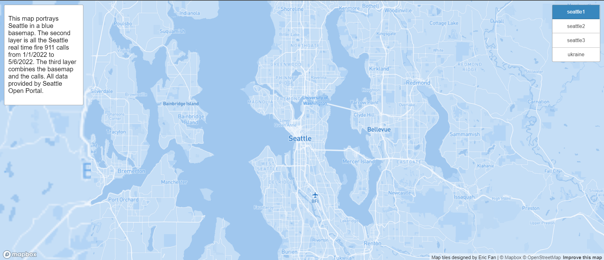
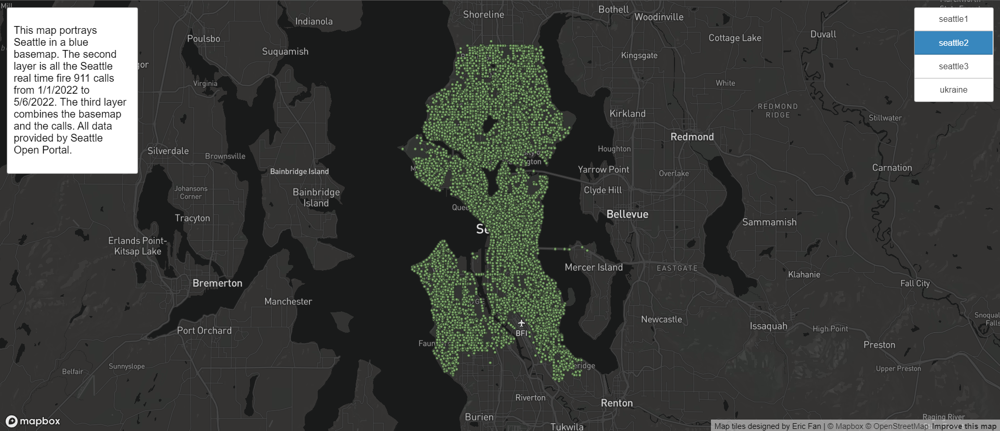
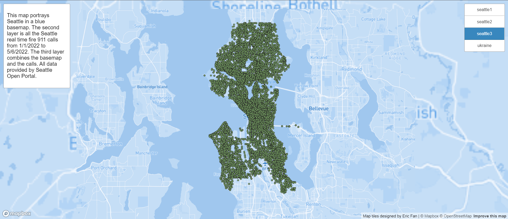
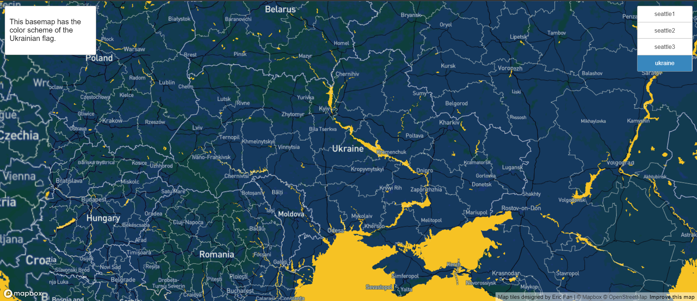
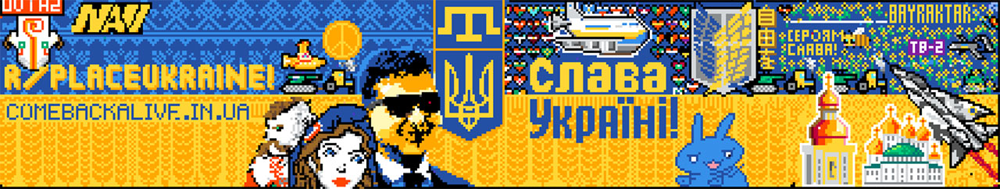

# Map Design and Tile Generation
## Introduction
For lab 4, I used used map tiles to display a map of Seattle and Ukraine with custom MapBox basemaps. The website can be accessed by [clicking here](https://ericfyl2.github.io/).

## Four Map Layers

Above is a screenshot of the first layer of the map. It depicts Seattle in MapBox monochrome template in blue. It offers a zoom level from 1 to 14.

Above is a screenshot of the second layer of the map. It depicts the locations of all the Seattle real time fire 911 calls from 1/1/2022 to 5/6/2022 with green dots. It offers a zoom level from 1 to 14. The data is provided by the City of Seattle via [Seattle Open Data](https://data.seattle.gov/Public-Safety/Seattle-Real-Time-Fire-911-Calls/kzjm-xkqj).

Above is a screenshot of the third layer of the map. It depicts the dots from the second layer overlayed on top of the first layer's basemap. This is a dot density map of Seattle's real time fire 911 calls from 1/1/2022 to 5/6/2022. It offers a zoom level from 1 to 14.

Above is a screenshot of the fourth layer of the map. It depicts Ukraine with a custom MapBox theme. The map has colors taken from the reddit r/place with artwork representing Ukraine. Below is the artwork.

It is made with MapBox's Cartogram function. It offers a zoom level from 1 to 10. It represents Ukraine's flag and invokes nationalism in a time of crisis for the country.